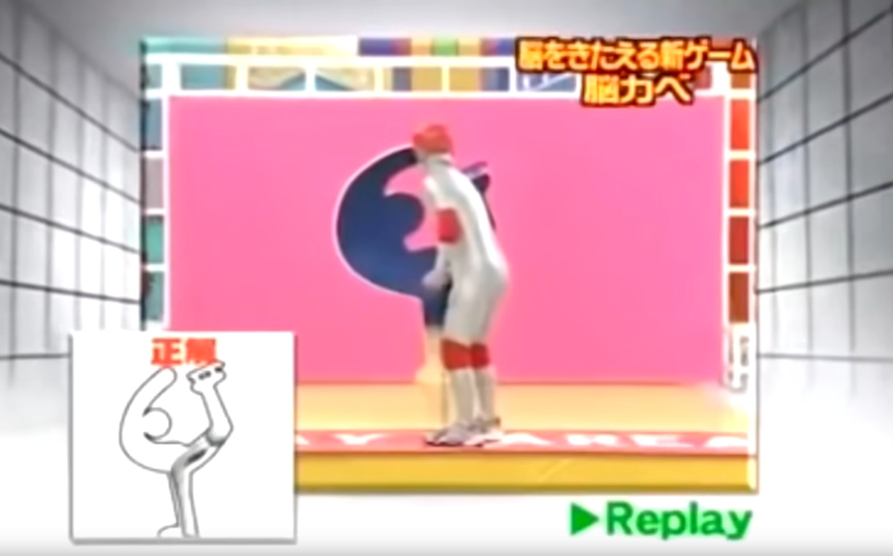
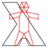
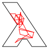

---
header-includes:
  # Underline links.
  - \hypersetup{colorlinks=false,
          allbordercolors={0 0 0},
          pdfborderstyle={/S/U/W 1}}
  - \usepackage[margin=1in]{geometry}
title: ICFP Contest 2021
subtitle: Specification v4.1
author: Alex Lang, Jasper Van der Jeugt
numbersections: true
...

# Introduction

After cleaning up bit rot in underground mines and communicating with aliens, an
era of peace and leisure has arrived in Lambda land.  This has lead to a number
of TV game shows really taking off.  One of these is **Brain Wall**, a contest
originating in Japan.  Many local versions of this have aired across the globe
and it is sometimes better known as **Human Tetris** or **Hole in the Wall**.



An automated system moves a styrofoam wall towards the player.  This wall has a
hole cut out, and the goal of the game is to assume a position with your body
that allows you to fit through the hole in the wall.  But just fitting through
the hole is not enough: in our variation, fully automated judges will count
the number of dislikes, which the participants try to minimize.

More background information about **Brain Wall** can be found on the
[wikipedia page](https://en.wikipedia.org/wiki/Brain_Wall).  You can also watch
some samples of the TV show
[on youtube](https://www.youtube.com/watch?v=6DYJXSSgW08).

# Updates

Note that there will be updates to this specification, and more problems will be
released during the contest.  This will happen at these specific times:

  * 12 hours into the contest (new problems only, no changes to specification)
  * 24 hours into the contest (after the lightning division ends)
  * 36 hours into the contest
  * 48 hours into the contest

We may also release smaller clarifications on the
[FAQ page](https://icfpcontest2021.github.io/faq.html).

## Changelog

 -  **v1.1** at 9 July, 12:43 UTC: Clarified that we only consider the last pose
    for each problem for each team.

 -  **v1.2** at 10 July, 00:00 UTC: Added HTTP API endpoint to obtain info about
    submitted solutions.

 -  **v2.0** at 10 July, 12:00 UTC: Added bonus system with `BREAK_A_LEG` and
    `GLOBALIST`.

 -  **v2.1** at 10 July, 14:13 UTC: Fixed naming inconsistency with $d$ and
    $d'$ in `GLOBALIST` constraint.

 -  **v3.0** at 11 July, 00:00 UTC: Added `WALLHACK` bonus

 -  **v4.0** at 11 July, 12:00 UTC: Added `SUPERFLEX` bonus

 -  **v4.1** at 11 July, 19:45 UTC: `WALLHACK` rule clarification

# Problem definition

The goal is to assume a **pose** with a given **figure** so that it fits into
the given **hole**, while scoring as many points as possible.

The figure and hole are both located on a two-dimensional grid.  They both
consist of line segments that all start and end at a point with integer X and Y
coordinates.



A hole is always a simple polygon: this means the line segments of the hole will
not intersect, and there will be no further holes within the hole.  A figure
consists of line segments that may connect to other line segments at the start
and end points.

Assuming a pose works by moving the start and end points of line segments into a
new configuration.  This is of course not without constraints, since our stick
figures cannot break the laws of physics!

We require that:

(a) If line segments connect in the original figure, they must also connect
    in the assumed pose.  The list of connections is explicitly indicated in
    the problem.

(b) Edges cannot be compressed or stretched arbitrarily.
    The amount that an edge can be stretched depends on the original edge
    length.

    We define the squared distance $d$ in between two points $p$ and $q$ as:

    $$
    d(p, q) = (p_x - q_x)^2 + (p_y - q_y)^2
    $$

    Let's assume an edge between vertices $v_i$ and $v_j$ exists the original
    figure, and $v'_i$ and $v'_j$ are the new positions of these points in the
    assumed pose.

    We then require that the ratio between the two squared lengths is at most
    $\varepsilon/1,000,000$ away from 1:

    $$
    \left| \frac{d(v'_i, v'_j)}{d(v_i, v_j)} - 1 \right| \leq \frac{\varepsilon}{1,000,000}
    $$

    $\varepsilon$ is an integer specified per problem.

Furthermore, if a pose is to be considered by the judges, the figure must of
course fit in the hole once the figure assumes the pose.

(c) Every point located on any line segment of the figure in the assumed pose
    must either lay inside the hole, or on its boundary.

When all these constraints are satisfied, the automated judges will count the
number of dislikes based on how well the pose fits in the hole.  The judges
prefer participants who take risk and place figure parts close to every corner
of the hole.

For every vertex $h$ in the hole, we take the squared distance to the nearest
vertex $v$ in the pose assumed by the figure and then add up those distances.

$$
\text{dislikes}(hole, pose) = \sum_{h \in hole} \min_{v \in pose} d(h, v)
$$

A lower number of dislikes is better.



# Submission

## Wire format

Problems and poses are encoded in JSON.  A complete example of a problem is
given at the bottom of this section.

Points

:   Points are encoded as a JSON array holding the X and Y coordinate, in that
    order.  Coordinates are always integers.

Hole

:   A hole is encoded as a JSON array containing all vertices of
    the hole in order. The minimum number of vertices is 3.

Figure

:   A figure is encoded as a JSON object with two properties:

     -  `vertices`: An array of points, indicating the initial locations of
        the vertices. The minimum number of vertices is 2.
     -  `edges`: An array of pairs, where each pair represents a line segment
        between the two vertices.  The pairs are given as two 0-based indices
        into the `vertices` array. The pairs can be specified in either order.
        The minimum number of edges is 1.

Problem

:   A problem is encoded as a JSON object with the following properties:

     -  `hole`: A **hole** as defined above.
     -  `figure`: A **figure** as defined above.
     -  `epsilon`: The $\varepsilon$ used for this problem.

Pose

:   A pose is encoded as a JSON object with a single property:

     -  `vertices`: An array of points, indicating the new positions of points
        in the assumed pose.

### Example

As a full example, here is the JSON encoding of the "Lambdaman" problem.

```json
{
  "hole": [
    [55, 80], [65, 95], [95, 95], [35, 5], [5, 5],
    [35, 50], [5, 95], [35, 95], [45, 80]
  ],
  "figure": {
    "edges": [
      [2, 5], [5, 4], [4, 1], [1, 0], [0, 8], [8, 3], [3, 7],
      [7, 11], [11, 13], [13, 12], [12, 18], [18, 19], [19, 14],
      [14, 15], [15, 17], [17, 16], [16, 10], [10, 6], [6, 2],
      [8, 12], [7, 9], [9, 3], [8, 9], [9, 12], [13, 9], [9, 11],
      [4, 8], [12, 14], [5, 10], [10, 15]
    ],
    "vertices": [
      [20, 30], [20, 40], [30, 95], [40, 15], [40, 35], [40, 65],
      [40, 95], [45, 5], [45, 25], [50, 15], [50, 70], [55, 5],
      [55, 25], [60, 15], [60, 35], [60, 65], [60, 95], [70, 95],
      [80, 30], [80, 40]
    ]
  },
  "epsilon": 150000
}
```

And this is the JSON encoding of the pose in the figure we saw earlier:

```json
{
  "vertices": [
    [21, 28], [31, 28], [31, 87], [29, 41], [44, 43], [58, 70],
    [38, 79], [32, 31], [36, 50], [39, 40], [66, 77], [42, 29],
    [46, 49], [49, 38], [39, 57], [69, 66], [41, 70], [39, 60],
    [42, 25], [40, 35]
  ]
}
```

## How to submit poses

Poses can be submit through the web portal at <https://poses.live>.  After
registering on that portal, teams can submit poses either directly through the
upload form provided in the web portal, or through an HTTP API at the same
domain.

In order to use the HTTP API, teams must first obtain their API token through
the web portal.  You can find this your team's page.  Each request must then
include this token in an `Authorization` header:

```http
Authorization: Bearer $YOUR_API_TOKEN
```

The HTTP API supports the following methods:

`GET /api/hello`

:   Says hello to your team.  This can be used to verify that your API token
    works.

`GET /api/problems/$PROBLEM_ID`

:   Retrieves the JSON encoding of the specified problem.

`POST /api/problems/$PROBLEM_ID/solutions`

:   Submit a pose.  The request body must contain a JSON encoding of a
    pose.  Returns a pose ID.

`GET /api/problems/$PROBLEM_ID/solutions/$POSE_ID`

:   Retrieves information about a submitted pose.  This is a JSON object
    with the following attributes:

     *  `state`: Either `PENDING`, `VALID` or `INVALID`.
     *  `dislikes`: The number of dislikes, when valid.
     *  `error`: The error message, when invalid.

**Regardless of whether you are using the HTTP API or web submission, you
cannot submit a pose for a problem if you already submitted a pose for
that problem within the last five minutes.**

## Scoring

For determining a team's score, only the latest submission for each problem
is considered.  If that submission is a valid pose, the team's score for that
specific problem is given by:

$$
\left\lceil 1000 * \log_2\left(\frac{|vertices| * |edges| * |hole|}{6}\right) * \sqrt{\frac{\text{dislikes}_{best} + 1}{\text{dislikes}_{team} + 1}} \right\rceil
$$

$|vertices|$ and $|edges|$ are the number of edges and vertices in the figure of
the problem, respectively.  $|hole|$ is the number of vertices in the hole.
$\text{dislikes}_{team}$ is the number of dislikes
counted by the judges for the team's pose, and $\text{dislikes}_{best}$ is
the lowest number of dislikes for this problem among all teams.

A team's total score is the sum of their scores for individual problems.

## Deadlines

As traditional, the contest will have a Lightning Division spanning the first 24
hours.  To qualify for the Lightning Division prize, submit your poses
by July 10, 2021, 12:00pm (noon) UTC.

To qualify for the Full Division prize, submit your poses by July 12, 2021,
12:00pm (noon) UTC.

In order to qualify for any prizes, your source code must be submitted by
the end of the contest as well.  You can do this through the web portal.

## Determing the Winner

We will use the same procedure to determine the winner in both the lightning and
full divisions, ranking the teams by cumulative score, computed as the sum of
scores for each task.

## The Judges' Prize

The judges' prize will be picked by the contest organisers. All entries in both
the full and lightning divisions are eligible for the judges' prize.

# Bonuses

Each brain wall problem may have specific locations that are preferred by the
judges.  Poses that manage to place a vertex at these specific locations are
awarded **bonuses**.  Each awarded bonus unlocks a certain advantage for a
specific puzzle.

Note that even though multiple bonuses can be available to use in a given
problem, participants may only use one per pose.

## Submission invalidation

Keep in mind that when using bonuses, submitting a pose that does not
unlock certain bonuses may **invalidate other poses, which can in turn
invalidate more poses**.

On the other hand, submitting poses that unlock certain bonuses may
**validate** other poses transitively as well, if these other poses
depended on these bonuses.

Validation based on bonuses always uses the latest submission for each problem.
The order in which submissions for different problems are submitted does not
matter.

## Wire format

The JSON objects for problems and poses are extended to support awarding
and using bonuses.

Problem

:   A problem JSON object may contain a `bonuses` property.
    This holds an array of JSON objects.
    Each of the objects in this array contains the following properties:

     -  `position`: The point on which a vertex must be placed to unlock the
        bonus.
     -  `bonus`: A string representing the type of bonus that can be unlocked.
     -  `problem`: The ID of the problem in which this bonus can be used once it
        has been unlocked.

Pose

:   A pose JSON object may contain a `bonuses` property.
    This holds an array of JSON objects.
    Each of the objects in this array contains the following properties:

     -  `bonus`: A string representing the type of bonus that is used.
     -  `problem`: The ID of the problem in which this bonus has been unlocked.

    In addition to `bonus` and `problem`, some bonuses may require additional
    properties indicating how the pose uses the bonus.

# Available bonuses

## GLOBALIST

Enabling the `GLOBALIST` bonus relaxes constraint (b) on the amount edges can
be compressed or stretched.  Rather than having an
constraint for each edge individually, you can use a global epsilon budget.
This global epsilon budget is the number of edges in the original figure
multiplied by $\varepsilon$.

$$
\sum_{(i, j) \in edges} \left| \frac{d(v'_i, v'_j)}{d(v_i, v_j)} - 1 \right| \leq \frac{| edges | \cdot \varepsilon}{1,000,000}
$$

## BREAK_A_LEG

Turning on `BREAK_A_LEG` allows you to specify a specific edge $(i, j)$ that is
broken in half at its midpoint; resulting in two smaller edges connected to a
new vertex.  The position of this new vertex must be added after the vertices of
the existing positions.

Constraint (b) is updated for these two new edges.  If we assume that $k$ is the
index of the newly added vertex, then this means we broke edge $(i, j)$
into new edges $(i, k)$ and $(j, k)$.
The edge length constraint on $d(v_i, v_j)$ is replaced by
the following constraints:

$$
\left| \frac{4d(v'_i, v'_k)}{d(v_i, v_j)} - 1 \right| \leq \frac{\varepsilon}{1,000,000}
$$
$$
\left| \frac{4d(v'_j, v'_k)}{d(v_i, v_j)} - 1 \right| \leq \frac{\varepsilon}{1,000,000}
$$

When a `BREAK_A_LEG` bonus is used, objects in the array in the `bonuses`
property of the JSON format for a pose must specify an additional `edge`
property.  `edge` must be an array in the shape of `[i, j]` where `i` and `j`
are the indices of the vertices between which you want to break the edge.

## WALLHACK

Enabling `WALLHACK` relaxes constaint (c) requiring the figure to fit in the
hole.  It makes it possible to place up to one vertex outside of the hole.  Any
edges connected to a vertex placed outside the hole are also alllowed to be partly
outside the hole.

## SUPERFLEX

Enabling the `SUPERFLEX` bonus relaxes constraint (b) on the amount edges can
be compressed or stretched: up to one edge can now
be arbitrarily compressed or stretched.

**Good luck and have fun!!!!!**
